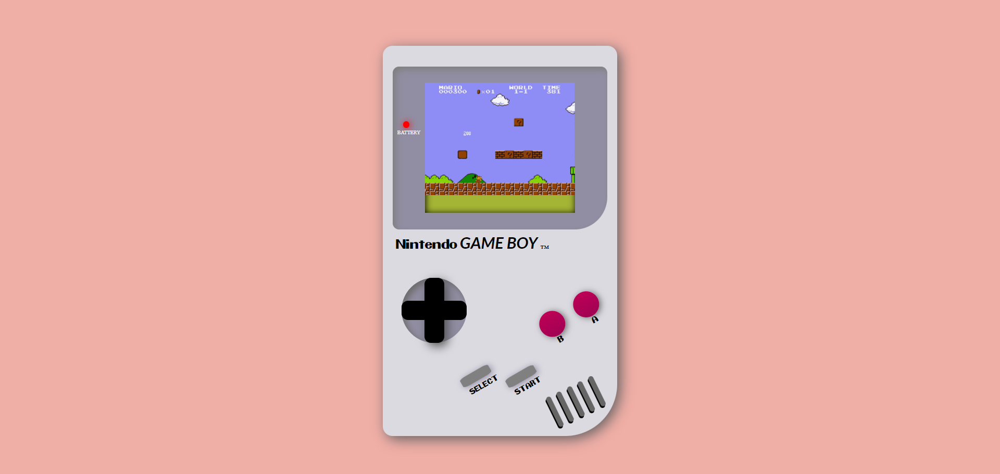

# GameBoy Consola🎮

  
Contenido 📝

  <ol>
    <li><a href="#objetivo-🎯">Objetivo</a></li>
    <li><a href="#sobre-el-proyecto-🔎">Sobre el proyecto</a></li>
    <li><a href="#vistas">Vistas</a></li>
  </ol>

## Objetivo 🎯

Crear una videoconsola con HTML y CSS.

## Sobre el proyecto 🔎

Es una consola GameBoy hecha con conocimientos de HTML y CSS, no posee ninguna funcionalidad solo es ilustrativa.

## Vistas

